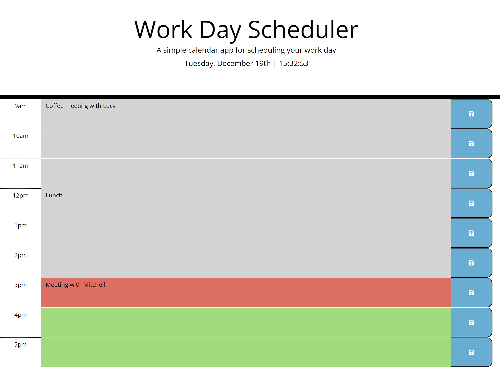

# Work planner application

## Description
A simple calendar application that allows a user to save events for each hour of the day. This application will run in the browser and feature dynamically updated HTML and CSS powered by jQuery.

## Usage
The current day and time is displayed at the top of the calendar.
The calendar includes timeblocks for standard business hours. Each timeblock is color-coded based on on past, present, and future. 
A user can enter an event when they click a timeblock and save it in local storage when the save button is clicked. Saved events persist between refreshes of a page.
Events which are not saved will be cleared after refreshing the page.

## Instalation
N/A

## Link to the deployed application
https://sonia-robin.github.io/planner-application/

## Credits
N/A

## Licences
N/A